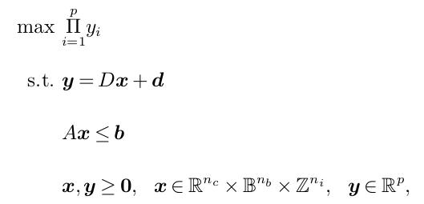
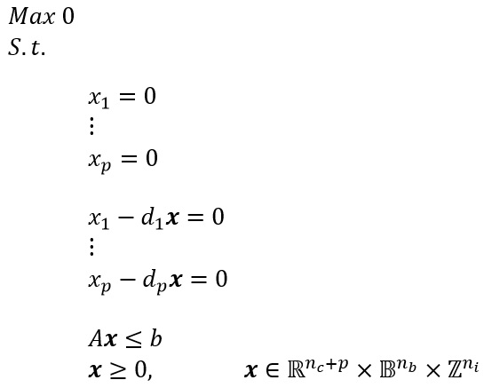

# Multi-objective-Mixed-Integer-Linear-Programming-Instances
Set of solved instances using BOMILP-MMP.cpp
# Instances
We generated instances for three values of p ∈ { 2, 3, 4 } , which refers to
the number of objective functions in a problem. In each case, we have four sets of instances, namely,
pure integer instances n i = n, pure binary instances n b = n, mixed integer instances n i = 0.5n and
n c = 0.5n, and mixed binary instance n b = 0.5n and n c = 0.5n. The problems are as follows,

Each set of instances contains 16 subclasses of instances based on the dimensions of the matrix A, where A is an M * N matrix, and each subclass contains 10 instances. To be specific, we assumed that m is in {200, 400, 800, 1600} and n=a*m where a is in {0.5, 1, 1.5, 2}. The sparsity of matrix A is 50%. The components of vector b and the entries of matrix A are randomly drawn from discrete uniform distributions [50, 150] and [1, 30], respectively. We set the vector d equal to zero. The sparsity of each row of the matrix D was also set to 50% and its components were drawn randomly from a discrete uniform distribution [1, 10].
It should be noted that, since all constraints are inequality and all coefficients of matrix A are nonnegative, the feasible regions are bounded.

We also note that, in cases with integer variables, we provided the converted instances. This is due to the fact that, in order to implement our algorithm, the integer variables must be converted to binary variables.

# instance.LP

The instances are written as CPLEX LP file as follows,

where f(x) is an arbitrary function which can be removed, x1 and x2 are the objective functions respresenting the y1 and y2 of the problem, and the rest of x are the decision variables.

Real, binary, and integer decision variables are distributed randomly in the instances, and therefore, there is no pattern for separating their indexes.
# Supporting and Citing

The instances were generated as part of academic research. If you would like to help support it, please star the repository as such metrics may help us secure funding in the future. We would be grateful if you could cite:

[Ghasemi Saghand, P., Charkhgard, H., Kwon, C., A Branch-and-Bound Algorithm for a Class of Mixed Integer Linear Maximum Multiplicative Programs: A Bi-objective Optimization Approach, Computers & Operations Research, 2018, ISSN 0305-0548,](https://doi.org/10.1016/j.cor.2018.08.004)
